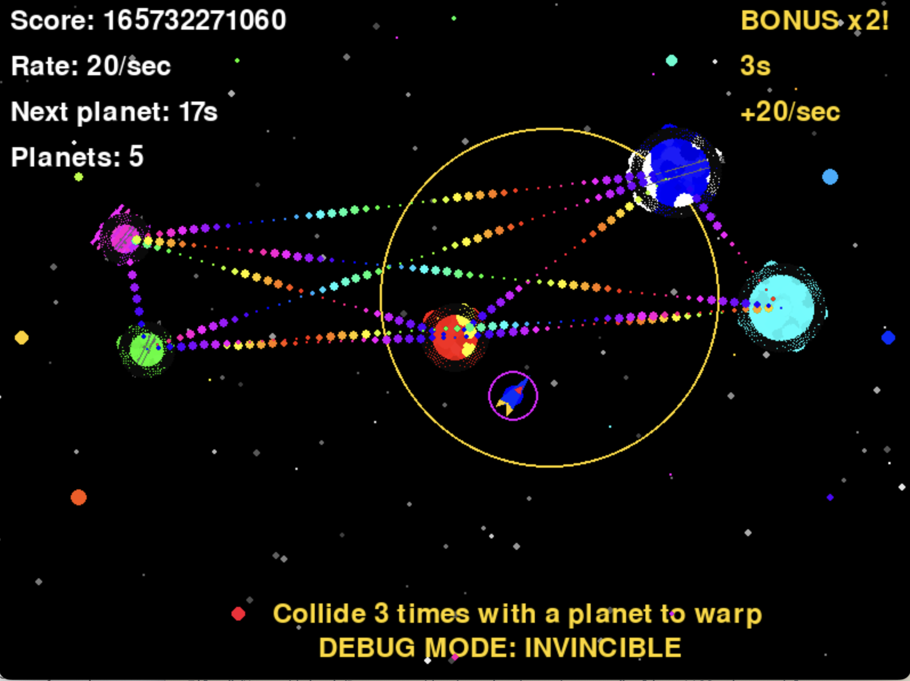

# Gravity Dance



重力を操り、宇宙空間でダンスするように飛行する2Dゲーム。カラフルな軌跡を描きながら惑星間を駆け抜けよう！

## ゲームの概要

Gravity Danceは、宇宙船を操作して惑星の重力を利用しながら宇宙空間を飛行するゲームです。惑星間を通過するとスコアが2倍になり、より高いスコアを目指します。美しい軌跡を描きながら、宇宙を自由に舞い踊るような感覚を味わえます。

## ゲームプレイ

プレイヤーは小さな宇宙船を操縦し、カラフルな惑星の重力を利用して加速したり方向を変えたりします。惑星に衝突すると通常はゲームオーバーですが、テクニックを磨けば惑星の重力をうまく使って高得点を狙えます！

スコアは時間とともに増加し、惑星間を通過するとボーナスが発生。「BONUS x2!」の表示と共にスコア倍率が上がります。どれだけ長く生き残り、高いスコアを記録できるかに挑戦しましょう。

## 操作方法

- **左矢印キー**: 左に回転
- **右矢印キー**: 右に回転
- **上矢印キー**: 推進力を得る
- **Dキー**: デバッグモード（無敵モード）の切り替え
- **Rキー**: ゲームオーバー時にリスタート
- **ESCキー**: ゲーム終了

## ゲームの特徴

- **重力物理**: リアルな物理演算による惑星の重力に影響される宇宙船の動き
- **惑星間通過ボーナス**: 惑星間を通過するとスコアが2倍になる爽快感
- **視覚効果**: 宇宙船の動きに合わせた美しいカラフルな軌跡エフェクト
- **デバッグモード**: Dキーで無敵モードに切り替え可能
- **プロシージャル生成**: 毎回異なる惑星のテクスチャはプログラムで自動生成
- **スコアシステム**: 時間経過とテクニックで高得点を競う

## 実行方法

### 必要なパッケージのインストール

```bash
# 必要なパッケージをインストール
pip install -r requirements.txt
```

### ゲームの実行

```bash
# 既存の仮想環境を使用する場合
source py312gravitydance/bin/activate

# ゲームを実行
python game.py
```

### 新規環境での実行方法

```bash
# 新しい仮想環境を作成
python -m venv venv

# 仮想環境を有効化
# Windows:
# venv\Scripts\activate
# macOS/Linux:
source venv/bin/activate

# 必要なパッケージをインストール
pip install -r requirements.txt

# ゲームを実行
python game.py
```

## デバッグモードの使い方

1. ゲーム中に「D」キーを押すと無敵モードになります
2. 無敵モードでは惑星と衝突してもゲームオーバーになりません
3. 同じ惑星に3回衝突すると、安全な場所にワープします
4. 無敵モード中は宇宙船が虹色に光り、シールドが表示されます

## プレイのコツ

- 惑星の重力を利用して「スイングバイ」のように加速しましょう
- 惑星間を通過する際は、軌道を慎重に計算して「BONUS x2!」を狙いましょう
- 宇宙船の推進力は限られているので、重力をうまく使って燃料を節約しましょう
- 複数の惑星が近くにある場合は、重力の相互作用を予測してルートを選びましょう
- 美しい軌跡を描くことも、このゲームの醍醐味です！

## スコアランキング

自己ベストスコアを更新して、友達と競争しましょう！
スコアは以下の要素で決まります：
- 生存時間
- 惑星間通過ボーナス（最大x8まで重複可能）
- 連続通過コンボ

## 開発情報

- **言語**: Python
- **ライブラリ**: Pygame
- **開発者**: daisei
- **バージョン**: 1.0.0

## 今後の予定

- オンラインランキング機能
- 追加ステージと難易度設定
- カスタマイズ可能な宇宙船
- モバイル版の開発

---

**Gravity Dance**で宇宙の旅を楽しみましょう！重力の波に乗って、美しい軌跡を描きながら宇宙を舞い踊ってください。
